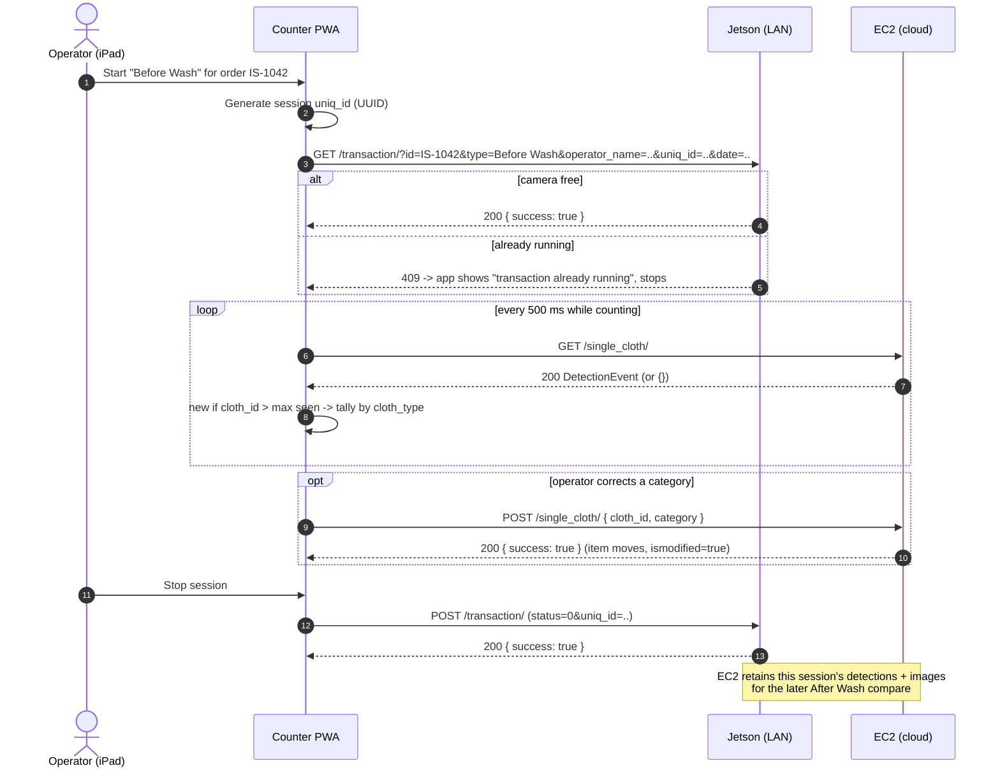
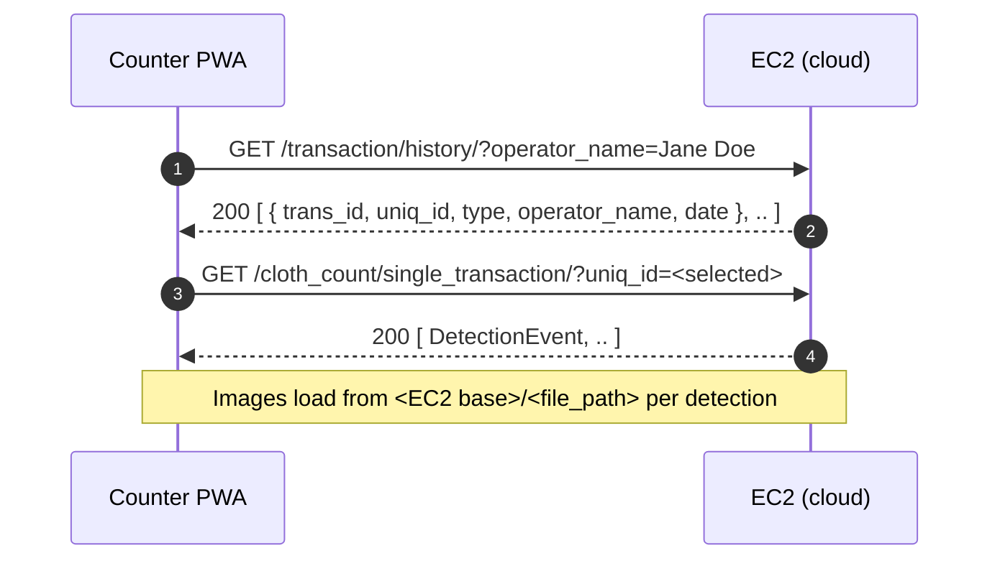

# Garment Counter — Backend Integration Guide (Jetson + EC2)

If you only read one file, read
[`API_CONTRACT.md`](./API_CONTRACT.md) — that is the exact request/response
spec. This guide explains *how the prototype was built*, *why*, and the *cutover
path* to production.

---

## 1. How we built the prototype

We built the Garment Counter iPad app (a React/Vite PWA) **against an API
contract first**, before any Jetson or EC2 hardware/backend existed. To make it
demo-able end to end, we wrote a **mock backend that implements that contract
exactly**.

There are three pieces:

1. **The contract** — [`API_CONTRACT.md`](./API_CONTRACT.md). This is the source
   of truth: every endpoint, method, query param, and JSON shape the app relies
   on. It was written from the app's actual network calls, so it is not
   aspirational — it's what the app does today.

2. **A standalone reference mock** — [`mock-server/server.mjs`](./mock-server/server.mjs),
   run with `npm run mock` (listens on `http://localhost:4000`). This is a
   runnable, readable implementation of every endpoint. Use it as executable
   documentation: hit it with curl/Postman and copy the behavior.

3. **An in-app demo mock (server-side)** — the same contract is also implemented
   inside our main API service at
   [`services/api/app/routes/counter_mock.py`](../../services/api/app/routes/counter_mock.py).
   It's mounted under **`/mockapi`** so the deployed PWA can be demoed over the
   same HTTPS origin (no CORS / mixed-content issues). It serves **fabricated
   data** and is **off by default** — see section 4.

**Key point for you:** the app is fully server-agnostic. Both backend base URLs
are typed into the app's **Settings** screen at runtime — nothing is hardcoded.
So "going live" is mostly: implement the endpoints, then change two URLs in
Settings. No app code change is required to switch from mock to real.

---

## 2. The two backends you're building

| Server | Reached over | Your responsibility |
|--------|--------------|---------------------|
| **Jetson** (camera device) | Local network (LAN) | Start / stop a counting transaction; run detection; push detections to EC2 |
| **EC2** (cloud) | Internet | Store detections; serve latest detection, corrections, per-session counts, history, dashboard, and images |

Data flow: **Jetson detects → pushes to EC2 → iPad polls EC2**. The iPad talks to
the Jetson only to start/stop a transaction; it never polls the Jetson for
detection data.

---

## 2a. Sequence diagrams

These render on GitHub (Mermaid). They show exactly which endpoint the iPad
calls at each step, on which backend.

### Before Wash — count items at intake



### After Wash — reconcile against Before Wash

```mermaid
sequenceDiagram
    autonumber
    actor Op as Operator (iPad)
    participant App as Counter PWA
    participant Jet as Jetson (LAN)
    participant EC2 as EC2 (cloud)

    Op->>App: Start "After Wash" for order IS-1042
    App->>EC2: GET /transaction/check/IS-1042/
    alt no Before Wash exists
        EC2-->>App: 200 { exists: false }  (app blocks, asks to do Before Wash first)
    else Before Wash exists
        EC2-->>App: 200 { exists: true }
        App->>EC2: GET /cloth_count/before_wash/?trans_id=IS-1042
        EC2-->>App: 200 [ DetectionEvent, .. ]  (baseline tallies + photos)
        App->>Jet: GET /transaction/?id=IS-1042&type=After Wash&uniq_id=..&..
        Jet-->>App: 200 { success: true }

        loop every 500 ms while counting
            App->>EC2: GET /single_cloth/
            EC2-->>App: 200 DetectionEvent (or {})
            App->>App: tally After Wash; compare vs Before Wash baseline
        end

        opt discrepancy found in a category
            App->>EC2: POST /move_cloth/ { cloth_id, target_category, trans_id }
            EC2-->>App: 200 { mismatch_resolved: true, new_status: "balanced" }
            App->>App: mark category resolved
        end

        Op->>App: Stop session
        App->>Jet: POST /transaction/ (status=0&uniq_id=..)
        Jet-->>App: 200 { success: true }
    end

    Note over App,EC2: Orders dashboard
    App->>EC2: GET /orders/summary/
    EC2-->>App: 200 [ { before_total, after_total, mismatch, .. } ]
```

### History and session detail (any time)



---

## 3. What you need to implement (checklist)

All shapes and params are in [`API_CONTRACT.md`](./API_CONTRACT.md); this is the
quick index. Match paths **exactly**, including trailing slashes.

**Jetson (LAN):**
- [ ] `GET /transaction/` — start a transaction (query: `id`, `type`,
      `operator_name`, `uniq_id`, `date`). Return `{"success": true}`, or `409`
      if one is already running.
- [ ] `POST /transaction/` — stop the active transaction (form body:
      `status`, `uniq_id`). Return `{"success": true}`.

**EC2 (cloud):**
- [ ] `GET /single_cloth/` — latest detection for the active session, or `{}`.
      **Polled every 500 ms** — keep it a cheap single-row lookup.
- [ ] `POST /single_cloth/` — correct latest cloth's category
      (`{cloth_id, category}`).
- [ ] `POST /move_cloth/` — resolve a discrepancy
      (`{cloth_id, target_category, trans_id}`) → `{mismatch_resolved, new_status}`.
- [ ] `GET /cloth_count/single_transaction/?uniq_id=X` — all items for a session.
- [ ] `GET /cloth_count/before_wash/?trans_id=X` — Before Wash items for an
      order (resolve the prior `uniq_id` server-side).
- [ ] `GET /transaction/check/{trans_id}/` — does a Before Wash exist?
      `{exists: bool}`.
- [ ] `GET /transaction/history/?operator_name=X` — session history.
- [ ] `GET /orders/summary/` — per-order Before/After rollup with `mismatch`.
- [ ] Serve detection images at `<EC2 base>/<file_path>` (see contract "Images").

**Contract rules that bite if missed:**
- **`cloth_id` must be strictly monotonically increasing per session.** The app
  detects "new" items solely by `cloth_id` growing; duplicates or lower values
  are silently dropped. (See "The cloth_id contract" in the contract.)
- **Required `DetectionEvent` fields** must always be present, or the app skips
  the record as malformed.
- **Image retention:** Before Wash photos are shown hours later during After
  Wash reconciliation — do **not** purge intake images at transaction close.
- **CORS + HTTPS/mixed-content:** if the app is served over HTTPS, browsers
  block calls to `http://` endpoints. Decide early whether the Jetson LAN
  endpoint is served over HTTP (app served over HTTP on the LAN) or gets a valid
  cert. This is the single biggest integration gotcha.

**How to validate your implementation:** run the app against your backend and
confirm a full Before Wash → After Wash → dashboard flow. Easiest is to
diff your responses against the reference mock:
```bash
cd apps/garment-counter
npm run mock                 # reference backend on :4000
curl http://localhost:4000/single_cloth/     # copy this shape exactly
```

---

## 4. How demo mode works today (so you know what you're replacing)

The in-app mock is gated by one server-side flag:

- Config: `enable_demo_counter` in
  [`services/api/app/config.py`](../../services/api/app/config.py), read from the
  env var **`ENABLE_DEMO_COUNTER`**. Default is `False`.
- Wiring: in [`services/api/app/main.py`](../../services/api/app/main.py), the
  mock router is mounted **only** when the flag is on:
  ```python
  if settings.enable_demo_counter:
      app.include_router(counter_mock.router, prefix="/mockapi", tags=["Counter Mock (DEMO)"])
  ```
- When enabled, the mock lives at **`/mockapi`** (e.g.
  `https://<origin>/mockapi/single_cloth/`), and the counter app's Settings point
  Camera + Cloud URLs at `https://<origin>/mockapi`.
- The mock holds all state in memory (resets on restart, not shared across
  instances) and serves fabricated detections and placeholder images. It is a
  demo shim only — never a real data source.

So in the demo, both "servers" collapse into one URL (`/mockapi`) on our own
origin. In production they are two separate real backends (Jetson LAN URL + EC2
cloud URL).

---
So in the demo, both "servers" collapse into one URL (`/mockapi`) on our own
origin. In production they are two separate real backends (Jetson LAN URL + EC2
cloud URL).

### What ships together in production (important)

Everything runs from **one deployment on one origin** — the single FastAPI
service serves all of these side by side:

| Path | What it is | Depends on the mock? |
|------|-----------|----------------------|
| `/admin` | Admin / POS app | No |
| `/` (customer routes) | Customer booking app | No |
| `/counter` | Garment Counter PWA (the frontend) | **No** |
| `/api/...` | Real backend API | No |
| `/mockapi/...` | Demo mock backend (only when `ENABLE_DEMO_COUNTER=true`) | — |

The key distinction: **`/counter` is the frontend; `/mockapi` is a fake
backend.** They are independent. The counter is server-agnostic — its Camera and
Cloud URLs are set in Settings. Pointing those at `/mockapi` is just the demo
configuration.

So removing demo mode **does not remove or break the counter app**. `/counter`
keeps shipping and running alongside admin/customer exactly as before; you simply
point its Settings at the real Jetson/EC2 URLs instead of `/mockapi`. Removing
demo mode only deletes the fake *backend*, never the counter *frontend*.

---

## 5. Cutover: switching from demo to real backends`API_CONTRACT.md`.
2. **In the iPad app Settings**, set:
   - **Camera URL (Jetson)** → the Jetson's LAN address (e.g.
     `http://192.168.1.50:8000` or its HTTPS URL).
   - **Cloud URL (EC2)** → the EC2 base URL (e.g. `https://api.yourec2.com`).
3. **Run a full validation session** on real hardware: start Before Wash, watch
   live counts, do a correction, stop, start After Wash, confirm the comparison
   and dashboard mismatch flag.

Until step 3 passes on real hardware, keep demo mode available as a fallback for
sales/demos.

---

## 6. Removing demo mode (once real backends are live)

When the real backends are validated in production, remove the mock so no
fabricated-data path can ever be enabled:

1. **Turn off the flag in every environment** — remove/unset
   `ENABLE_DEMO_COUNTER` (or set it to `false`) in Render (and any other deploy).
   This alone makes `/mockapi` return 404, since the router is no longer mounted.
2. **Remove the code (optional but recommended for a clean cutover):**
   - Delete the mount block in
     [`services/api/app/main.py`](../../services/api/app/main.py) (the
     `if settings.enable_demo_counter:` include and its import of
     `counter_mock`).
   - Delete [`services/api/app/routes/counter_mock.py`](../../services/api/app/routes/counter_mock.py).
   - Remove the `enable_demo_counter` setting from
     [`services/api/app/config.py`](../../services/api/app/config.py).
   - Optionally keep [`mock-server/server.mjs`](./mock-server/server.mjs) and
     `API_CONTRACT.md` in the repo as living documentation for future backend
     work — they don't ship to production and are useful reference.
3. **Redeploy** and confirm `/mockapi/single_cloth/` now returns 404 while the
   app works against the real Camera/Cloud URLs.

**Recommended sequence:** do step 1 (flip the flag off) first and run in
production for a short bake period pointing only at real backends. Once you're
confident, do step 2 (delete the code) as a separate change. That way the
cut